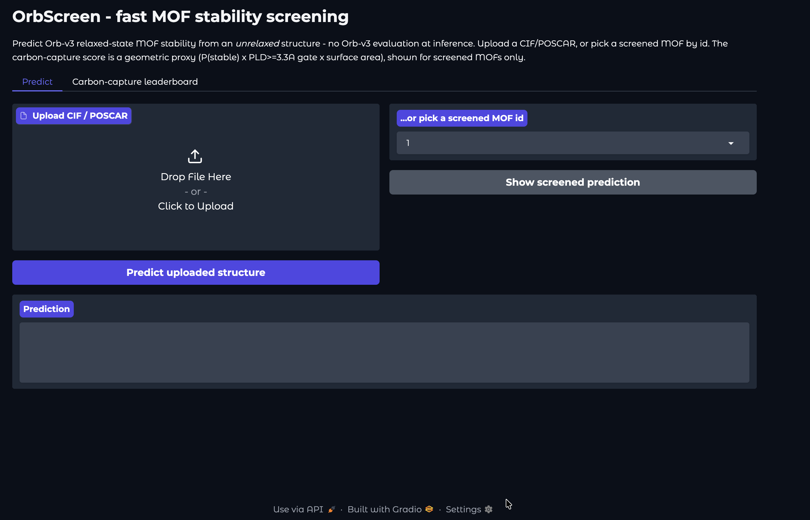
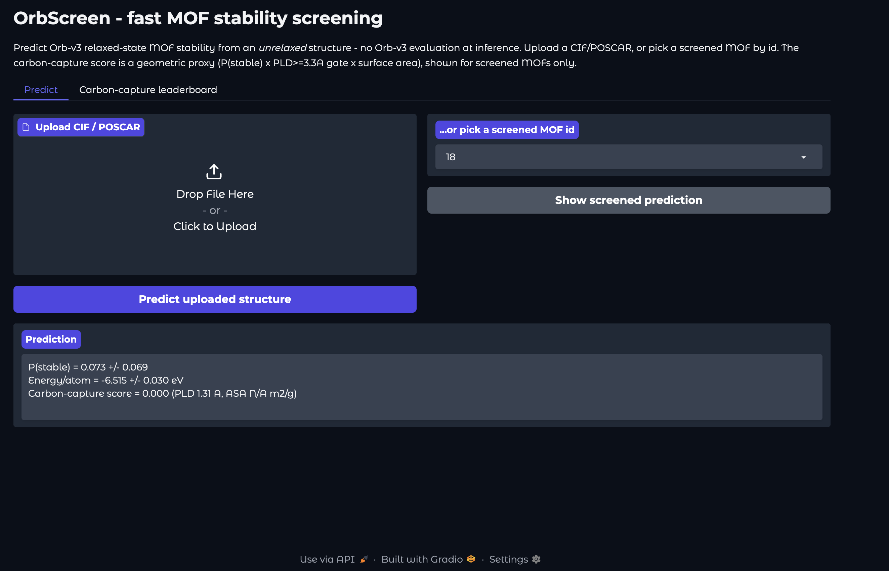
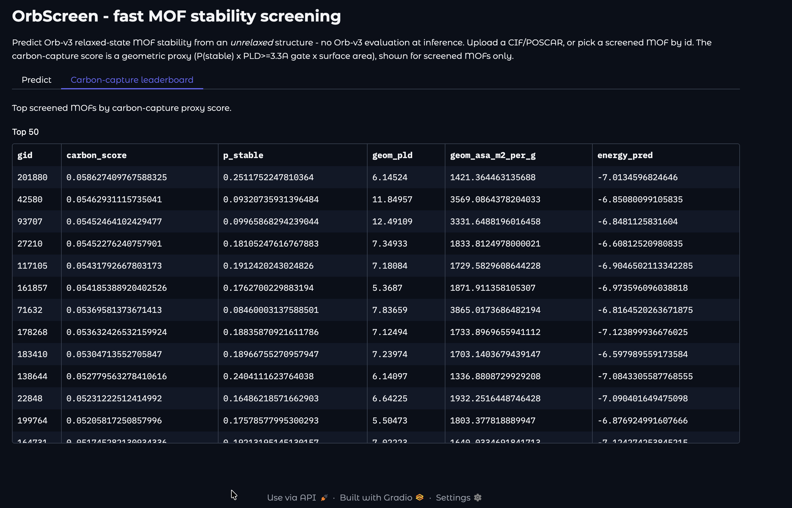

# OrbScreen

A fast, Orb-free surrogate that predicts Orb-v3 relaxed-state MOF stability directly from unrelaxed structures, enabling high-throughput screening of metal-organic frameworks. Built on Orbital Materials' open Orb-v3 model and MofasaDB dataset.

## Quickstart

```bash
uv sync --extra dev
uv run pytest

# Build the dataset from MofasaDB (downloads ~4.5 GB of ASE DBs on first run)
uv run orbscreen build --out data/dataset.parquet
# Train + evaluate the descriptor baseline on both splits
uv run orbscreen baseline --data data/dataset.parquet
```

## Data

MofasaDB ships 201,926 generated MOFs as two ASE DBs (`samples.db` unrelaxed,
`relaxed.db` Orb-v3-relaxed). The pipeline pairs them **positionally by row id**
(neither `structure_id` nor `mofid` is a unique key — verified by formula match across
all 201,926 rows), extracts the relaxed Orb-v3 energy/atom as the regression target and a
validity-flag-based stability label, and writes a unified Parquet with random and
leakage-free topology-holdout splits. See `docs/data-schema.md`.

## Phase 1 baseline results

Descriptor baseline (gradient-boosted trees on pyzeo geometry + composition features),
evaluated on the held-out test split. Predicting the **relaxed** state from the
**unrelaxed** structure, with no Orb evaluation at inference:

| Metric | random split | topology holdout |
|---|---|---|
| Energy/atom MAE (eV) | 0.076 | 0.076 |
| Energy/atom Spearman | 0.94 | 0.92 |
| Stability AUROC | 0.88 | 0.92 |
| Stability AUPRC (base rate ~0.05) | 0.26 | 0.27 |
| Enrichment @ top-10% | **5.2×** | **5.4×** |

Screening the top 10% by predicted P(stable) recovers stable MOFs at ~5× the base rate,
and the topology-holdout (unseen frameworks) holds up as well as the random split — the
descriptors capture transferable stability signal. This is the floor the learned GNN
surrogate must beat.

Numbers are reproducible (seed 0) and captured in `results.json`:

```bash
uv run orbscreen build --out data/dataset.parquet
uv run orbscreen baseline --data data/dataset.parquet --out results.json
```

## Phase 2: GNN surrogate (beats the baseline)

A multi-task crystal GNN (`CrystalGNN`: atom embeddings + Gaussian-RBF edge features + `CGConv`
message passing, with energy and stability heads) learns directly from the **unrelaxed PBC
graph** — no hand-built descriptors, and still no Orb evaluation at inference. Trained on Modal
(A10G) with val-based early stopping + best-checkpoint; predictions come from a **deep ensemble**
with calibrated uncertainty.

**Deep ensemble vs the descriptor baseline (test set):**

| Metric | Baseline (rand) | **GNN (rand)** | Baseline (topo) | **GNN (topo)** |
|---|---|---|---|---|
| Energy MAE (eV/atom) | 0.076 | **0.036** | 0.076 | **0.029** |
| Energy Spearman | 0.936 | **0.992** | 0.917 | **0.989** |
| Stability AUROC | 0.881 | **0.932** | 0.924 | **0.956** |
| Stability AUPRC (base ~0.05) | 0.262 | **0.319** | 0.271 | **0.420** |
| Enrichment @ top-10% | 5.24× | **6.07×** | 5.37× | **7.13×** |
| Calibration (ECE) | — | **0.0064** | — | **0.0098** |

The GNN ensemble **halves the baseline's energy error** and lifts top-10% enrichment to ~6–7×,
on both the random split and the **topology-holdout** (unseen RCSR frameworks), with
well-calibrated uncertainty (ECE < 0.01). Per-split results are in
`results_gnn_split_random.json` / `results_gnn_split_topology.json`; model details in
`docs/model-card.md`.

> Note: the topology-holdout test is the valid-topology subset (n=2,270) vs the random split's
> full-population test (n=20,194), so absolute numbers *across* splits aren't directly
> comparable; the GNN-vs-baseline comparison *within* each split (same test set) is fair.

GNN training/eval (Modal GPU) lives in `src/orbscreen/gnn/`:

```bash
modal run src/orbscreen/gnn/modal_app.py --mode train --seed 1            # random-split model
modal run src/orbscreen/gnn/modal_app.py --mode train_topology --seed 0   # topology-holdout model
modal run src/orbscreen/gnn/modal_app.py --mode eval --split split_random
```

See `ATTRIBUTION.md` for data/model licenses.

## Phase 3: scaled screen + cost-accuracy cascade

The deep ensemble screens all 201,926 MOFs in one batched GPU pass (reusing the Phase 2 graph caches), then a cost-accuracy cascade routes only the hard candidates to real Orb-v3.

| | Surrogate (this work) | Orb-v3 relaxation |
|---|---|---|
| Throughput (structs/s/GPU) | 149.1 | 0.211 |
| Cost - inference only (USD/million) | 2.05 | 1,447 |
| Cost - end-to-end incl. graph build (USD/million) | 10.29 | 1,447 |

Routing 20% of candidates (highest-uncertainty policy) to Orb-v3 recovers 98.1% of Orb-v3's top-10% stable MOFs at 5.0x lower cost than relaxing everything.
For energy ranking, routing the top-ranked 15% (confirm-top-ranked policy) recovers 99.8% at 6.6x lower cost.
Full Pareto curves (three routing policies, stability and energy rankings) are in `cascade.json`; see `cascade_stability.png` and `cascade_energy.png`.

Reproduce (Modal GPU for the screen + Orb-v3 timing benchmark, then local cascade analysis):

```bash
modal run src/orbscreen/gnn/modal_app.py --mode screen
modal run src/orbscreen/gnn/modal_app.py --mode benchmark_orb --sample 100
orbscreen cascade --predictions screen_predictions.parquet \
  --screen-timing screen_timing.json --orb-benchmark benchmark_orb.json
```

## Phase 4: live demo + carbon-capture shortlist

A Modal-hosted Gradio demo serves the surrogate on CPU (scale-to-zero).
Upload a CIF/POSCAR or pick a screened MOF by id to get calibrated P(stable) + uncertainty + predicted energy/atom; the carbon-capture leaderboard ranks screened MOFs by a geometric proxy score.


The carbon-capture score is `P(stable) * 1[PLD >= 3.3 A] * normalize(surface area)` - a geometric shortlist proxy (not GCMC).

### Demo screenshots

Predict tab: upload a CIF/POSCAR or pick a screened MOF by id.



A prediction: calibrated P(stable) + uncertainty + energy/atom, with the carbon-capture score shown for screened MOFs.



Carbon-capture leaderboard: top screened MOFs ranked by the proxy score.



Deploy:

```bash
uv sync --extra dev --extra gnn --extra app
modal deploy src/orbscreen/app/modal_app.py
```
